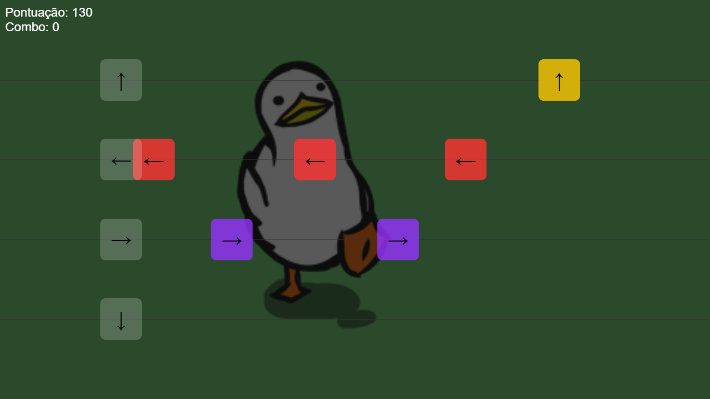

  
  
<em><b>Beta</b> Web JavaScript Rhythm Game</em>

  

### **Músicas Disponíveis atualmente:** 
| Joyful - Chess(Slowed) | MINE - A Miku BIG SHOT | ABYSSAL BLADE |
|----------|----------|----------|
|  |  |  |

---

## **Sim, javascript puro**  
- **game.js** → Contem toda a estrutura do jogo  
- Cada musica possui um JSON com a ordem das notas no seu index
- Lê a hora que as notas devem ser acertadas, e calcula o tempo para serem criadas com base na velocidade e tamanho da tela

---

## **Funcionalidades**  
- **Sistema de notas sincronizadas** com a música  
- **Controle de pontuação** baseado em precisão   
- **Velocidade varíavel** sem aumentar a dificuldade  
- **Contagem de combos** (sequência de acertos)  

---

## **Melhorias Futuras**  
- Corrigir bug do xbox
- Implementação para mobilie
- Adicionar notas longas

---

## **Como Rodar Localmente**  
1. **Clone o repositório** ou faça o download dos arquivos.  
2. Abra o arquivo **`index.html`** no navegador.  
3. **Escolha uma música** e comece a jogar!  

---

*Lembrando que ainda esta em BETA*
